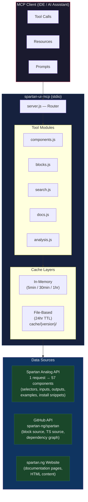

# Spartan UI MCP Server

An MCP (Model Context Protocol) server that gives AI assistants full access to the [Spartan Angular UI](https://www.spartan.ng) ecosystem — components, blocks, source code, and documentation.

## What It Does

- **57 UI Components** with structured API data (Brain & Helm APIs) — selectors, inputs, outputs, models, and code examples
- **17 Building Blocks** — complete page-level Angular components (sidebar layouts, login/signup forms, calendar interfaces) fetched from GitHub
- **TypeScript Source Code** — actual component library source from the `spartan-ng/spartan` repository
- **Canonical Dependency Graph** — real component dependencies from the Spartan CLI
- **Documentation** — 13 topics including installation, theming, CLI usage, and more
- **Instant Search** — search across all components by name, selector, directive, or property

## Quick Start

Configure your MCP client (Claude Desktop, Cursor, VS Code, etc.):

```json
{
  "mcpServers": {
    "spartan-ui-mcp": {
      "command": "npx",
      "args": ["spartan-ui-mcp"]
    }
  }
}
```

### With GitHub Token (recommended)

For block source code and component source fetching, a GitHub token gives you 5000 req/hr instead of 60:

```json
{
  "mcpServers": {
    "spartan-ui-mcp": {
      "command": "npx",
      "args": ["spartan-ui-mcp"],
      "env": {
        "GITHUB_TOKEN": "ghp_your_token_here"
      }
    }
  }
}
```

No special scopes needed — the token just authenticates against the public repo.

<details>
<summary><strong>How to get a GitHub token</strong></summary>

1. Go to [github.com/settings/tokens](https://github.com/settings/tokens?type=beta)
2. Click **"Generate new token"** > **"Fine-grained token"**
3. Give it a name (e.g., `spartan-mcp`)
4. Set expiration (90 days or custom)
5. Under **"Repository access"**, select **"Public Repositories (read-only)"**
6. No additional permissions needed — leave everything else as default
7. Click **"Generate token"** and copy the `github_pat_...` value

Classic tokens also work: create one at [github.com/settings/tokens/new](https://github.com/settings/tokens/new) with no scopes selected.

</details>

### Development Setup

```bash
git clone https://github.com/SOG-web/spartan-ui-mcp.git
cd spartan-ui-mcp
npm install
npm start        # or: npm run dev (auto-reload)
```

## Tools (17)

### Components

| Tool | Description |
|------|-------------|
| `spartan_components_list` | List all 57 components with URLs |
| `spartan_components_get` | Get structured API data (Brain/Helm directives, inputs, outputs, examples). Uses the Spartan Analog API for perfect data quality. |
| `spartan_components_source` | Fetch actual TypeScript source code from GitHub (`libs/brain/` or `libs/helm/`) |
| `spartan_components_dependencies` | Get the canonical dependency graph for any component |

### Blocks

| Tool | Description |
|------|-------------|
| `spartan_blocks_list` | List all building block categories and variants |
| `spartan_blocks_get` | Fetch complete block source code from GitHub. Returns Angular component files with template, imports, and extracted Spartan/Angular dependencies. |

### Search & Documentation

| Tool | Description |
|------|-------------|
| `spartan_search` | Instant search across components by name, selector, directive, or input/output property |
| `spartan_docs_get` | Fetch documentation topics (installation, theming, CLI, dark-mode, etc.) |
| `spartan_meta` | Get full metadata for autocomplete (all components, blocks, and tool usage) |

### Health & Cache

| Tool | Description |
|------|-------------|
| `spartan_health_check` | Check spartan.ng page availability |
| `spartan_health_instructions` | Get Spartan CLI health check instructions |
| `spartan_health_command` | Build `ng`/`nx` health check commands |
| `spartan_cache_status` | View cache statistics |
| `spartan_cache_clear` | Clear cached data |
| `spartan_cache_rebuild` | Rebuild cache (components, docs, and optionally blocks from GitHub) |
| `spartan_cache_switch_version` | Switch Spartan UI version for caching |
| `spartan_cache_list_versions` | List all cached versions |

## Resources

MCP resources provide read-only data via URI scheme:

- `spartan://components/list` — all components with metadata
- `spartan://component/{name}/api` — Brain & Helm API specifications
- `spartan://component/{name}/examples` — code examples
- `spartan://component/{name}/full` — complete documentation with install snippets
- `spartan://blocks/list` — all block categories and variants

## Prompts

Pre-built conversation templates:

- `spartan-get-started` — get started with a component (brain or helm)
- `spartan-compare-apis` — compare Brain API vs Helm API
- `spartan-implement-feature` — implement a feature with a component
- `spartan-troubleshoot` — troubleshoot component issues
- `spartan-list-components` — list all components by category
- `spartan-use-block` — use a building block in your project

## Example Usage

```jsonc
// Get dialog API — returns 7 Brain + 10 Helm directives with full specs
{ "tool": "spartan_components_get", "arguments": { "name": "dialog" } }

// Get sidebar source code from GitHub
{ "tool": "spartan_components_source", "arguments": { "name": "sidebar", "layer": "helm" } }

// Get a login block with shared utilities
{ "tool": "spartan_blocks_get", "arguments": { "category": "login", "variant": "login-simple-reactive-form", "includeShared": true } }

// Search for date-related components
{ "tool": "spartan_search", "arguments": { "query": "date" } }

// Get sidebar dependencies (with transitive)
{ "tool": "spartan_components_dependencies", "arguments": { "componentName": "sidebar", "includeTransitive": true } }
```

## Architecture



### Request Flow

```
┌─────────────┐     ┌──────────────┐     ┌─────────────┐     ┌──────────────────┐
│  AI asks:   │────▶│  MCP Tool:   │────▶│  Cache hit?  │────▶│  Return cached   │
│  "How do I  │     │  components  │     │  Yes ───────▶│     │  structured JSON  │
│  use the    │     │  _get        │     │  No ────┐    │     └──────────────────┘
│  sidebar?"  │     │  name:sidebar│     └─────────┘    │
└─────────────┘     └──────────────┘            │       │
                                                ▼       │
                                    ┌───────────────────┘
                                    │  Fetch from source
                                    ├─ extract=api  → Analog API (structured JSON)
                                    ├─ extract=code → spartan.ng (HTML scraping)
                                    └─ source tool  → GitHub API (TypeScript files)
```

## Data Sources

The server uses a hybrid approach for maximum data quality:

| Source | Used For | Method |
|--------|----------|--------|
| Spartan Analog API | Component APIs, examples, install snippets | Single JSON endpoint for all 57 components |
| GitHub API (`spartan-ng/spartan`) | Block source code, component TypeScript source | Contents API with in-memory caching |
| spartan.ng website | Documentation pages, HTML content | HTTP fetch with file-based caching |
| Spartan CLI metadata | Dependency graph (canonical) | Embedded from `primitive-deps.ts` |

## Caching

Two layers:

1. **In-memory** — 5min for website content, 30min for Analog API, 1hr for GitHub API
2. **File-based** — 24hr TTL under `cache/{version}/` with subdirectories for components, docs, blocks, and source

## Environment Variables

| Variable | Default | Description |
|----------|---------|-------------|
| `GITHUB_TOKEN` | — | GitHub PAT for higher rate limits (5000/hr vs 60/hr) |
| `SPARTAN_CACHE_TTL_HOURS` | `24` | File cache TTL in hours |
| `SPARTAN_CACHE_TTL_MS` | `300000` | In-memory cache TTL in ms |
| `SPARTAN_FETCH_TIMEOUT_MS` | `15000` | HTTP request timeout in ms |

## Testing

```bash
node test-e2e.js    # 34 end-to-end tests via MCP client protocol
```

## License

MIT

---

Built for the [Spartan Angular UI](https://www.spartan.ng) community.
